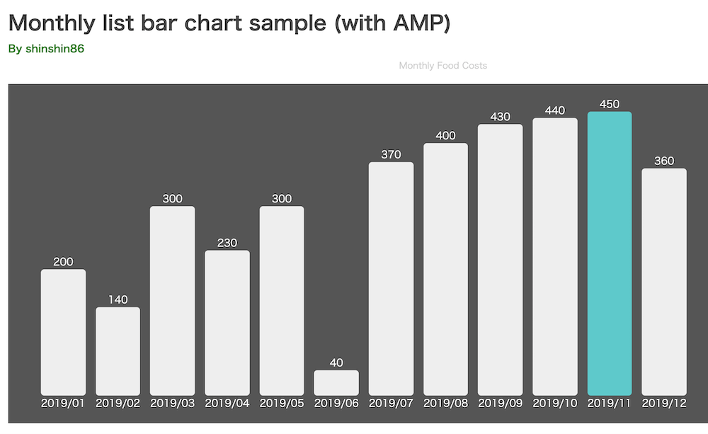

# Monthly list bar chart sample (with AMP)



## Start development server

```
yarn dev
```

---

# Google AMP

This example shows how to create AMP pages using Next.js and the AMP feature. It shows a normal page (non-AMP), an AMP only page, and a hybrid AMP page.

## Deploy your own

Deploy the example using [Vercel](https://vercel.com):

[](https://vercel.com/import/project?template=https://github.com/vercel/next.js/tree/canary/examples/amp)

## How to use

### Using `create-next-app`

Execute [`create-next-app`](https://github.com/vercel/next.js/tree/canary/packages/create-next-app) with [npm](https://docs.npmjs.com/cli/init) or [Yarn](https://yarnpkg.com/lang/en/docs/cli/create/) to bootstrap the example:

```bash
npx create-next-app --example amp amp-app
# or
yarn create next-app --example amp amp-app
```

### Download manually

Download the example:

```bash
curl https://codeload.github.com/vercel/next.js/tar.gz/canary | tar -xz --strip=2 next.js-canary/examples/amp
cd amp
```

Install it and run:

```bash
npm install
npm run dev
# or
yarn
yarn dev
```

Deploy it to the cloud with [Vercel](https://vercel.com/import?filter=next.js&utm_source=github&utm_medium=readme&utm_campaign=next-example) ([Documentation](https://nextjs.org/docs/deployment)).
